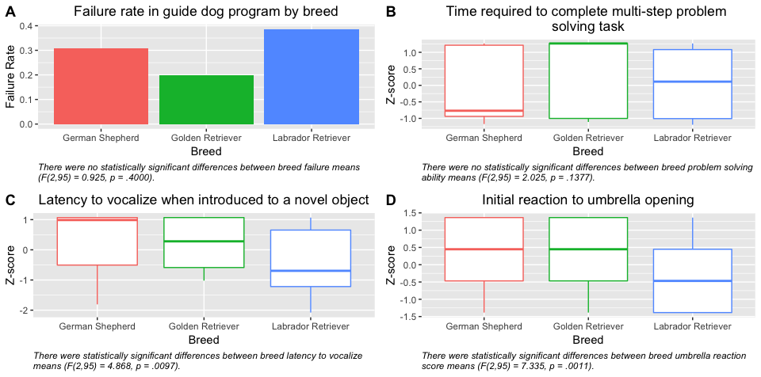
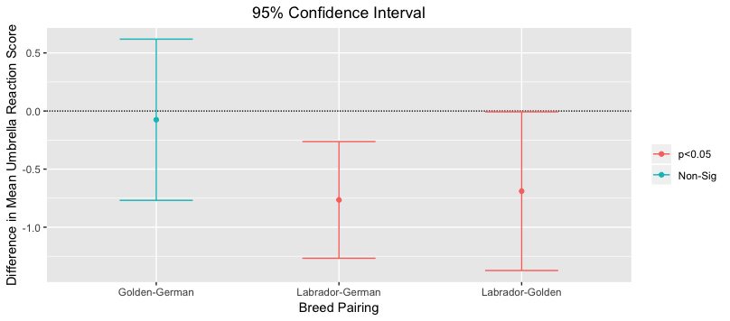
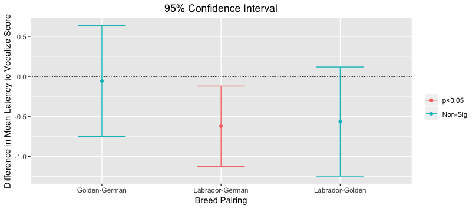
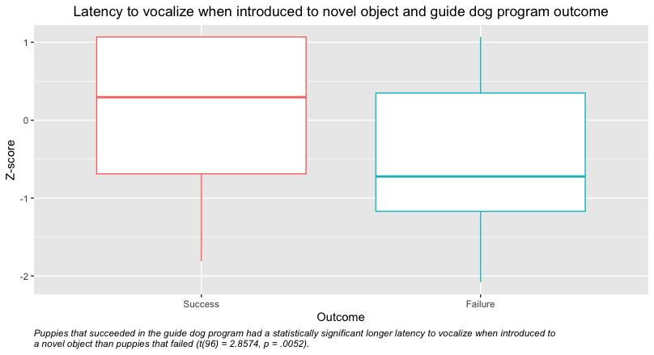

# Relationships between Breed, Temperament, and Guide Dog Success

## Driving Question
Do different breeds of guide dog program puppies affect behavior and ultimate success as a guide dog?

## Introduction

This data analysis will provide interesting information into how dog breed effects behaviors differently. Not only is it important to look at if behaviors show any relationship to breed but also what kinds of behaviors increase/decrease the chance of success as a guide dog. The information obtained from this analysis can hopefully offer insight to guide dog programs and puppy trainers as to what kinds of behaviors they should focus on modifying through training to increase chance of success. These conclusions can also be used to do further research into what specifically about these breeds leads to the differences. Is it something about the genetics? Physiology? Maternal care?

## Methods
#### Data Source
The data set used to complete this analysis, [*Behavioral guide dog data*](https://datadryad.org/resource/doi:10.5061/dryad.50fj0), comes from public data available in the Dryad Digital Repository. This data set includes data from guide dog program puppies to test for an association between maternal investment, behavior and intelligence with failure or success in the guide dog program. Some of the contents of the data include:
 - Puppy characteristics: failure or success, litter, sex, birth season, litter size, breed, test age
 - Z-scores for variable performance
 - Principal component scores for tasks derived from Z scores
 - Descriptions of variables and tasks

To produce the data, researchers followed a group of guide dog program puppies from the nursing stage (~2 weeks) all the way up until they returned to the program for more formal guide dog training. To obtain the data on temperament and cognition, the researchers created eleven tasks for each dog to complete and then measured several variables relating to the task. For example, one task involved isolating the dog in an empty room and then introducing it to a novel object. The researchers provided a [video](http://movie-usa.glencoesoftware.com/video/10.1073/pnas.1704303114/video-2) of this specific task. Variables included time until puppy approached the object, time spent oriented towards the object and time until dog vocalized (Bray, Sammel, Cheney, Serpell & Seyfarth, 2017). Information on other tasks and the variables associated with them can be found in table S2 of the paper's [supplemental information](chrome-extension://oemmndcbldboiebfnladdacbdfmadadm/https://www.pnas.org/content/pnas/suppl/2017/08/02/1704303114.DCSupplemental/pnas.201704303SI.pdf?targetid=nameddest%3DSTXT).

The 108 KB data set was provided in a Microsoft Excel Spreadsheet which included 5 spreadsheets total:
 - 3 sheets of puppy data
	 - first row: descriptors
	 - subsequent rows: characteristics and scores for the 133 puppies
 - 2 sheets of data descriptions

#### Original Analysis

The goal of "Effects of maternal investment, temperament, and cognition on guide dog success" was to determine what, if any, factors can predict success as a guide dog. The study aimed to address the assertion that early life experiences, intelligence and behavior can be attributed to one's outcome of success, not just for dogs, but also other species like humans (Bray et al., 2017). Using guide dog program puppies as a "model" of sorts, researchers wanted to determine the effects of maternal investment, specifically nursing behavior, and temperament on success.

To address the aims of the study, Bray et al. (2017) built logistic regression models to test for an association between maternal investment and outcome along with puppy temperament and outcome. To calculate, for example, maternal investment a principal component analysis was used to compile many different maternal behavior scores into one.

In addition to the PCA, Bray et al. (2017) also performed an odds ratio test to determine if puppy scores for individual task variables were associated with either success or failure. For many of these variables, no significant association was found, however, there was a significant association between low levels of maternal behavior, multi-step problem solving skills and quietness when introduced to a novel object. From this information the researchers created bar graphs showing the success rates of certain scores for these traits. All of these tests looked at the group as a whole and did not differentiate for variables such as breed, gender, or litter size.

#### My Analysis
All of my analysis was performed using R Studio Version 3.5.1, Tidyverse packages and the data provided by Bray et al. (2017). The script used for this analysis can be found in the Assignment09 directory in the file "GDDataAnalysis.R". In order to create data in a fashion that was workable for my analysis I first needed to subset and concatenate all the required data. From two of the spreadsheets I created a data frame that for each puppy included its outcome (failure or success), breed, multi-step problem solving score, latency to vocalize when introduced to a novel object score, and reaction to umbrella opening score. These scores were standardized and presented as Z-scores. To make sure all information was complete I removed any individuals (puppies) who were missing data for any of the variables, resulting in 98 useable individuals.

Next, I created a function which would output the average z-score of a given variable for each of the three breeds (German Shepherd, Golden Retriever, Labrador Retriever). I used this function to find the failure rate, average multi-step problem solving score, average latency to vocalize when introduced to a novel object score, and average reaction to umbrella opening score for each breed. My analysis differs from the analysis done by Bray et al. in that it accounts for dog breed as a possible variable which affects guide dog program outcome or temperament/behavior. I also created a function which performed an ANOVA test on all of the variables mentioned above. The means and resulting p-scores of the ANOVA tests were put into a table. Using the ggplot package, I displayed these results as either a bar plot or box plot depending on the variable. From the table, I determined which variables had significant p-values and moved on to perform further analyses on these.

Two of the ANOVA tests returned significant p-values and for those two variables I performed Tukey HSD tests and also showed these results through ggplot graphics. Finally, I carried out a t-test to see if puppies that failed showed significantly different scores for certain variables and showed these results in box plots.

## Results and Conclusions
Four one-way ANOVAs were conducted to compare the effect of dog breed (German Shepherd, Golden Retriever, Labrador Retriever) on failure rates, mean multi-step problem solving score, mean latency to vocalize when introduced to a novel object score, and mean reaction to umbrella opening score. There was not a significant effect of breed on failure rate [F(2,95) = 0.925, p = .4000] or multi-step problem solving scores [F(2,95) = 2.025, p = .1377] at the p<.05 level for the three breeds. There was a significant effect of breed on latency to vocalize scores [F(2,95) = 4.868, p = .0097] and umbrella reaction scores [F(2,95) = 7.335, p = .0011] at the p<.05 level for the three breeds.

**Fig. 1.** Relationship between breed and (A) failure rates in the program, (B) multi-step problem solving task performance, (C) latency to vocalize when introduced to a novel object and (D) initial reaction to umbrella opening.

Post hoc comparisons using the Tukey HSD test indicated that the mean umbrella reaction score for Labrador Retrievers (M = -0.3643) was significantly different than for German Shepherds (M = 0.4008) (p=.0013) and Golden Retrievers (M=0.3256) (p=.0470). However, Golden Retrievers did not significantly differ from German Shepherds for this score (p=.9640). These results suggest that Labrador Retrievers react much more calmly to an umbrella opening than do German Shepherds or Golden Retrievers.

**Fig. 2.** Tukey HSD test results showing difference in mean umbrella reaction scores for each breed pairing. Red indicates a significant difference while blue indicates a non-significant difference.

To determine how influential this difference can be on a dog's outcome in the guide dog program, I performed a two sample t-test to compare umbrella reaction scores in dogs that succeeded and dogs that failed in the program. There was not a significant difference in the scores for dogs that succeeded (M=-0.0242) and dogs that failed (M=0.1901); t (96)=2.8574, p = .3318. These results suggest that performance on the umbrella opening task did not significantly contribute to a dog's outcome in the program, which is why a high performance on this task by Labrador Retrievers is not reflected in an overall high success rate in Labrador Retrievers.

The same procedure was used to assess mean latency to vocalize scores. Post hoc comparisons using the Tukey HSD test indicated that the mean latency to vocalize score for Labrador Retrievers (M = -0.3812) was significantly different than for German Shepherds (M = 0.2409) (p=.0110). However, Golden Retrievers (M = 0.1835) did not significantly differ from Labrador Retrievers or German Shepherds for this score. These results suggest that Labrador Retrievers vocalized significantly quicker when introduced to a novel object than German Shepherds.

**Fig. 3.** Tukey HSD test results showing difference in mean latency to vocalize scores for each breed pairing. Red indicates a significant difference while blue indicates a non-significant difference.

To determine how influential this difference can be on a dog's outcome in the guide dog program, I once again performed a two sample t-test to compare latency to vocalize scores in dogs that succeeded and dogs that failed in the program. There was a significant difference in the scores for dogs that succeeded (M=0.1460) and dogs that failed (M=-0.4455); t (96)=2.8574, p=.0052. These results suggest that dogs who succeeded in the program waited much longer to vocalize when introduced to a novel object than dogs that failed. Specifically, this may suggest that high Labrador Retriever failure rates compared to German Shepherds could possibly be related to their short latency to vocalize when introduced to a novel object.

**Fig. 4.** Relationship between guide dog program outcome and latency to vocalize when introduced to a novel object. Successful dogs showed a longer latency to vocalize than dogs that failed.

In conclusion, outcome in the guide dog program is not statistically different for different breeds, however some behaviors and traits show statistically significant differences for different breeds and those behaviors and traits affect outcome in the guide dog program. This indicates that behavioral differences amongst breeds can influence success. More research should be conducted and performed on a larger population to further examine the effects of breed. Determining the best breeds to use for guide work is important to saving resources in the breeding and training phases of guide dog programs.

## References
Bray EE, Sammel MD, Cheney DL, Serpell JA, Seyfarth RM (2017) Data from: Effects of maternal investment, temperament, and cognition on guide dog success. Dryad Digital Repository. [https://doi.org/10.5061/dryad.50fj0](https://doi.org/10.5061/dryad.50fj0)

Bray EE, Sammel MD, Cheney DL, Serpell JA, Seyfarth RM (2017) Effects of maternal investment, temperament, and cognition on guide dog success. Proceedings of the National Academy of Sciences of the United States of America 114(34): 9128-9133. [https://doi.org/10.1073/pnas.1704303114](https://doi.org/10.1073/pnas.1704303114)
